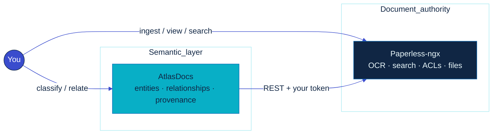

# AtlasDocs

<p align="center">
  
</p>

<p align="center">
  <a href="https://github.com/didac-crst/atlas-docs/actions/workflows/ci.yml"></a>
  <a href="https://github.com/didac-crst/atlas-docs/pkgs/container/atlasdocs"></a>
  
  
</p>

<p align="center">
  <strong>Paperless stores the documents. AtlasDocs stores the meaning.</strong>
</p>

<p align="center">
  Typed entities · relationships · provenance · classification<br/>
  on top of <a href="https://docs.paperless-ngx.com/">Paperless-ngx</a> — without replacing it.
</p>

## Why

Paperless-ngx nails ingest, OCR, search, previews, and permissions. Tags help, but they don’t answer:

> What *is* this document, and how does it connect to everything else?

That gap shows up fast in a real archive (taxes, employment, housing, correspondence):

- Meaning lives in your head, not in the system
- Tags are flat — no direction, inverses, or provenance
- Forking Paperless to add semantics couples two hard problems
- Stuffing a knowledge model into Paperless’s DB fights upgrades and ownership

AtlasDocs keeps Paperless as the document system of record and adds a **semantic layer beside it**.

## How

| Concern | Owner |
| --- | --- |
| Files, OCR, search, previews, ACLs, lifecycle | **Paperless** |
| Entities, concepts, typed relationships, classification | **AtlasDocs** |

- **REST only** — no Paperless DB, no filesystem mounts, no embedded viewer
- **AtlasDocs UUIDs** — Paperless ids bind via `ExternalReference(system=paperless)`
- **Entity ↔ entity edges** — concepts *and* document↔document links, with origin + status
- **Auth follows Paperless** — your token; denial → not found; no semantic leaks
- **Reconcile without amnesia** — create missing bindings, report orphans, **never** auto-delete
- **Workbench, not a second archive** — React UI under `/ui`; tokens stay server-side (HttpOnly + CSRF)



## What’s in v0.4

- Entity + ExternalReference core (PostgreSQL / Alembic)
- JSON API — documents, entities, relationships, ontologies, reconcile
- `atlasdocs reconcile` + `POST /reconcile` (dry-run, limits)
- React + TypeScript + Vite classification workbench
- Version-controlled seed ontologies and relationship types

**Not yet:** LLMs, embeddings, graph-first UI, native notes, auto-delete. See the [roadmap](docs/roadmap.md).

## Docs

| | |
| --- | --- |
| [Architecture](docs/architecture.md) | Model, ownership, boundaries |
| [Document lifecycle](docs/document-lifecycle.md) | Create, replace, delete, tombstone, completeness |
| [Frontend](docs/frontend.md) | SPA, BFF, auth, brand |
| [API](docs/api.md) | JSON + `/ui/api` surfaces |
| [Paperless](docs/paperless-integration.md) | REST rules, `BASE` vs `PUBLIC` URL |
| [Reconciliation](docs/reconciliation.md) | Safety + CLI/HTTP |
| [Development](docs/development.md) | Setup, env, layout |
| [Testing](docs/testing.md) | Pytest, Vitest, Playwright, CI |
| [Roadmap](docs/roadmap.md) | Next + deferred |
| [ADRs](docs/adr/) · [Archive](docs/archive/) | Decisions · history |

## Quick start

```bash
python3 -m venv .venv && source .venv/bin/activate
pip install -e '.[dev]'
pytest

cd frontend && npm install && npm test && npm run build && cd ..
docker compose up --build
```

Open **http://localhost:8080/ui**, paste a Paperless token, classify.
Token stays on the server; the browser only gets an opaque HttpOnly session.

| Env | Role |
| --- | --- |
| `PAPERLESS_BASE_URL` | Server → Paperless REST (can be internal) |
| `PAPERLESS_PUBLIC_URL` | Browser “Open in Paperless” only — **never** falls back to `BASE` |

Full config: [docs/development.md](docs/development.md).

---

Public product. Deploy anywhere. No private-infra assumptions baked in.

Brand: [`assets/atlas-docs-wordmark.svg`](assets/atlas-docs-wordmark.svg) · [`assets/atlas-docs-mark.svg`](assets/atlas-docs-mark.svg)
