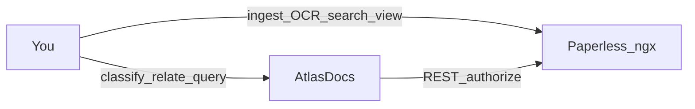

# AtlasDocs

<p align="center">
  
</p>

**A semantic layer for documents you already trust in Paperless-ngx.**

AtlasDocs does not replace Paperless. It sits beside it and answers a different
question: *what does this document mean, and how does it relate to everything
else?*

## The problem

Paperless-ngx is excellent at the hard parts of a personal or small-team
archive: ingest, OCR, search, previews, permissions, and document lifecycle.
Tags and correspondents help, but they stop short of a durable **knowledge
model**.

In practice that gap shows up as:

- **Meaning lives in people’s heads.** “This payslip is from Germany,” “this
  invoice replies to that letter,” “these two PDFs are the same claim in
  different forms” — none of that is a first-class, queryable fact.
- **Tags are flat.** They do not encode typed relationships, direction,
  inverses, or provenance (who asserted this, and how).
- **Replacing Paperless is the wrong bet.** Rebuilding viewers, OCR, ACLs, and
  storage just to add semantics couples two hard problems and throws away a
  mature document system.
- **Mixing semantics into Paperless’s database is brittle.** Upstream upgrades,
  permissions, and ownership boundaries get tangled with classification
  experiments you may want to evolve independently.

Teams that care about long-lived personal archives — taxes, employment,
housing, correspondence — need **confirmed, typed relationships** with clear
authority boundaries, not another dashboard on top of the same tags.

## The approach

AtlasDocs is a **separate semantic product** that treats Paperless as the
document authority and itself as the meaning authority.

| Concern | Owner |
| --- | --- |
| Files, OCR, search, previews, permissions, lifecycle | **Paperless-ngx** |
| Entities, concepts, typed relationships, provenance, classification workflows | **AtlasDocs** |

Design choices that follow from that split:

1. **REST-only integration.** AtlasDocs never mounts Paperless media, never
   reads Paperless databases, and never embeds a document viewer. “Open in
   Paperless” is a deep link; viewing stays where it belongs.
2. **AtlasDocs identity, Paperless binding.** Every semantic object has an
   AtlasDocs UUID. Paperless document ids appear only as
   `ExternalReference(system=paperless, …)` — so semantics survive renumbering
   debates and stay portable.
3. **Typed entity↔entity relationships.** Not only “document → concept,” but
   also document↔document edges (for example derived-from), with directionality,
   inverses, origin, and status.
4. **Authorization follows Paperless.** Callers prove access with a Paperless
   token (API header or server-side UI session). Denial becomes not-found —
   AtlasDocs does not leak titles or relationships for documents you cannot see.
5. **Reconciliation without amnesia.** A deterministic reconcile creates missing
   document bindings and reports orphans; it **never** auto-deletes semantic
   knowledge when Paperless is temporarily unreachable or a file is removed.
6. **A classification workbench, not a second archive UI.** A React workbench
   under `/ui` helps turn an unclassified queue into confirmed relationships.
   Tokens never reach the browser; the BFF keeps them in an HttpOnly session.



## What you get today (v0.4)

- **Entity + ExternalReference** core in PostgreSQL (versioned with Alembic)
- **JSON API** for documents, entities, relationships, ontologies, and reconcile
- **`atlasdocs reconcile`** / `POST /reconcile` with dry-run and optional limits
- **React + TypeScript + Vite** classification workbench with CSRF-protected BFF
- **Seeded ontologies** (countries, document types, people, organizations, …)
  and relationship types you can extend in version-controlled YAML

Intentionally **not** in scope yet: LLM auto-classification, embeddings, graph
exploration as the primary UI, native notes, or automatic deletion. See the
[roadmap](docs/roadmap.md).

## Who it is for

- People running Paperless who want **structured meaning** without leaving
  Paperless as the document system of record
- Operators who need a **public, self-contained** product (Compose/image) that a
  private deployment can pin — not a fork of Paperless and not a host-specific
  appliance

This repository is the public product. It must remain deployable without any
particular private infrastructure, tunnel, or secret store.

## Documentation

| Doc | Contents |
| --- | --- |
| [Architecture](docs/architecture.md) | Entities, references, relationships, ownership |
| [Frontend](docs/frontend.md) | React SPA, BFF auth, brand |
| [API](docs/api.md) | JSON API and BFF surfaces |
| [Paperless integration](docs/paperless-integration.md) | REST boundary, BASE vs PUBLIC URL |
| [Reconciliation](docs/reconciliation.md) | CLI / HTTP reconcile safety |
| [Development](docs/development.md) | Local setup, env, layout |
| [Testing](docs/testing.md) | Test layers and CI |
| [Roadmap](docs/roadmap.md) | Forward work and deferred features |
| [ADRs](docs/adr/) | Durable architecture decisions |
| [Archive](docs/archive/) | Historical milestone proposals |

## Quick start

```bash
python3 -m venv .venv
source .venv/bin/activate
pip install -e '.[dev]'
pytest

cd frontend && npm install && npm test && npm run build && cd ..

docker compose up --build
```

Open `http://localhost:8080/ui`, paste a Paperless API token, and classify.
The token stays server-side; the browser only receives an opaque HttpOnly
session cookie.

Configure `PAPERLESS_BASE_URL` for server→Paperless REST and, optionally,
`PAPERLESS_PUBLIC_URL` for browser “Open in Paperless” links (never a fallback
to the base URL). Full setup: [docs/development.md](docs/development.md).

## Brand assets

- `assets/atlas-docs-wordmark.svg` — README and full-width product identity
- `assets/atlas-docs-mark.svg` — compact icon / favicon contexts
