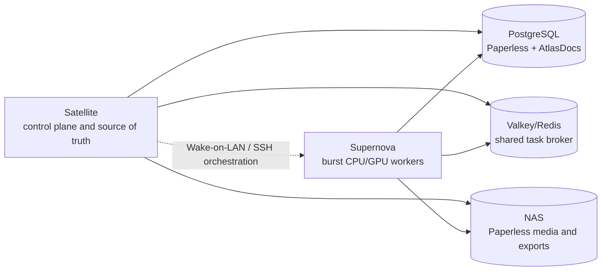
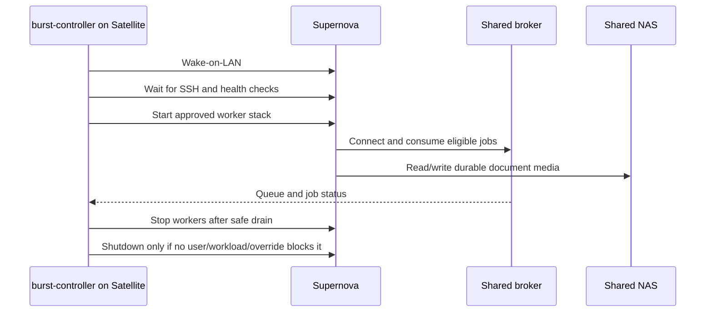

# AtlasDocs Burst Compute Architecture

## Status

Proposed infrastructure design. This is documentation only; it does not authorize deployment, Wake-on-LAN, shared-worker configuration, or automatic shutdown.

## 1. Objective

Provide optional burst compute for Paperless-ngx and future AtlasDocs enrichment workloads.

Satellite is the always-on Raspberry Pi control plane. Supernova is a 24-core, 128 GB RAM, NVIDIA GPU machine that is normally powered off and may be woken when significant background work exists.

Supernova is disposable compute. It must never own authoritative state and may disappear at any time without compromising document integrity.



## 2. State ownership

Satellite remains authoritative for:

- Paperless web frontend, authentication, and document ingestion
- PostgreSQL and AtlasDocs semantic data
- Valkey/Redis task broker and central orchestration
- NAS-backed Paperless media, archive, and export data
- burst-controller state and policy

Supernova may contain only Docker images, temporary files, caches, Ollama models, model caches, temporary OCR workspaces, and logs. Loss, shutdown, or reinstallation of Supernova must not cause permanent data loss.

## 3. Shared infrastructure and versioning

Workers must use the same PostgreSQL database, Valkey/Redis broker, Paperless media storage, relevant configuration, and exact Paperless image version. Do not allow different Paperless versions to operate against the same database.

The intended image must be pinned, for example:

```text
ghcr.io/paperless-ngx/paperless-ngx:3.0.5
```

Paperless uses Celery-style background processing and a Redis-compatible broker. The architecture is conceptually compatible with separating web and task processing, but the exact worker-only Docker command for the selected image must be verified from the image and documentation rather than guessed.

## 4. File-system and ingestion boundaries

Every worker that needs document files must see the same durable NAS-backed media at identical container paths. Do not maintain a second media library on Supernova.

Example:

```text
Satellite:  /mnt/atlas-docs/media -> /usr/src/paperless/media
Supernova:  /mnt/atlas-docs/media -> /usr/src/paperless/media
```

Satellite is the only node that watches the normal Paperless consumption directory. Supernova must not independently watch `/usr/src/paperless/consume`. API and web ingestion continue through Satellite; once a task is in the shared queue, an eligible worker may process it.

AtlasDocs must reference documents by Paperless document ID, never by physical filename. IDs are allocated centrally by PostgreSQL/Paperless.

## 5. Supernova operating model

Normal state: powered off.

Burst state:

- powered on and reachable
- Docker running
- approved Paperless worker stack running
- Ollama available only when a GPU workload requires it

Supernova must not expose the primary Paperless web UI.

## 6. Burst controller

Satellite should eventually run a `burst-controller` responsible for:

1. measuring pending heavy work;
2. deciding whether Supernova is useful;
3. sending Wake-on-LAN;
4. waiting for reachability and health checks;
5. starting the approved worker stack;
6. monitoring queue drain and active jobs;
7. checking that shutdown is safe;
8. stopping workers and requesting shutdown.

Do not wake Supernova for every document. Initial policy must be configurable, for example:

```text
wake if pending heavy jobs >= 50
OR estimated Satellite processing time >= 20 minutes
```

Use hysteresis to avoid power cycles:

```text
wake threshold:       50 jobs
drain threshold:       5 jobs
idle grace period:    10 minutes
```

These are starting values, not fixed requirements.

## 7. Safe shutdown

An empty Paperless queue is not sufficient to shut down Supernova. Before shutdown, verify:

- no interactive desktop session;
- no active SSH session;
- no protected long-running Docker workload;
- CPU and GPU utilization below configured thresholds;
- no AtlasDocs/Paperless job executing;
- no manual keep-awake override.

Provide an explicit override such as `/var/run/supernova-keep-awake` and commands equivalent to:

```text
supernova-keep-awake on
supernova-keep-awake off
```

When shutdown is blocked, the controller must report the reason. The override always wins.

## 8. Startup and control

Supernova BIOS/UEFI and its network interface must support Wake-on-LAN. Docker should be enabled at boot, but the approved worker stack should preferably be started explicitly by Satellite after SSH and health checks succeed:



Use a dedicated SSH automation account and narrowly allowlisted commands. Do not use unrestricted root login.

## 9. Worker configuration

Satellite normal operation should remain conservative, for example one task worker and one thread per worker. Supernova must begin conservatively; do not immediately consume all 24 logical cores.

Benchmark candidates include 8 workers x 2 threads or 12 workers x 1 thread, but the correct value must be measured. Leave headroom for PostgreSQL, NAS I/O, Ollama, decompression, and other work.

The product of `TASK_WORKERS * THREADS_PER_WORKER` must remain within the available CPU capacity. Larger worker counts help many independent documents; more threads can help very large documents. Confirm the exact environment variable names and worker command for Paperless image 3.0.5 before implementation.

Do not assume standard Paperless OCR benefits from the NVIDIA GPU. Initially reserve GPU processing for Ollama, summaries, structured extraction, embeddings, and future vision/document models.

## 10. Job classes

AtlasDocs should eventually classify jobs as:

- `normal`: ordinary ingestion, small OCR, routine maintenance;
- `heavy`: large imports, OCR reprocessing, bulk classification;
- `gpu`: summaries, embeddings, and model-based extraction.

Queue length alone should not be the permanent scheduling model.

For future enrichment, persist the job centrally using a Paperless document ID. Supernova reads the required OCR/document data, runs Ollama, writes results to the AtlasDocs database, and marks the central job complete. It must not retain the only authoritative copy of a result locally.

## 11. Failure behavior

If Supernova loses power during processing, documents and central state must remain intact. Jobs must either return to the queue or become detectable as failed/stale without manual repair.

If Supernova cannot reliably reach PostgreSQL, the broker, or NAS, it must stop accepting work rather than process against partial state. Satellite must continue operating with Supernova offline.

## 12. Observability

Satellite should track Supernova as `OFF`, `BOOTING`, `ONLINE`, `BUSY`, `IDLE`, `KEEP-AWAKE`, or `ERROR`, plus queue depth, worker count, active jobs, throughput, wake time, durations, CPU/GPU usage, last contact, wake reason, blocked-shutdown reason, and daily runtime.

Telegram should notify only abnormal states by default:

- failed wake-up;
- worker stack failed to start;
- repeated job failures;
- NAS unavailable;
- shutdown failed.

Routine wake and shutdown may remain silent.

## 13. Security

Supernova must not expose infrastructure services publicly. Use LAN SSH for orchestration. Restrict PostgreSQL and Valkey to explicitly allowed hosts/networks and never expose them through Cloudflare or the public Internet. Keep SSH keys and credentials in Satellite's secrets management, never Git.

## 14. Configuration

Keep policy in non-secret configuration and credentials in secrets:

```text
SUPERNOVA_HOST=10.10.x.x
SUPERNOVA_MAC=xx:xx:xx:xx:xx:xx
SUPERNOVA_WAKE_JOB_THRESHOLD=50
SUPERNOVA_DRAIN_THRESHOLD=5
SUPERNOVA_IDLE_GRACE_MINUTES=10
SUPERNOVA_CPU_IDLE_THRESHOLD=10
SUPERNOVA_GPU_IDLE_THRESHOLD=5
SUPERNOVA_KEEP_AWAKE_FILE=/var/run/supernova-keep-awake
```

Do not commit real addresses, MAC addresses, SSH keys, or credentials.

## 15. Implementation phases

### Phase 1 - Manual worker validation

Mount the NAS on Supernova, use the exact Paperless image version, connect to Satellite's broker and PostgreSQL, disable unnecessary services, start a worker manually, submit about 20 test documents, and verify processing, IDs, media integrity, and recovery. Do not implement auto-wake.

The first technical task is exploratory: inspect how image 3.0.5 launches its web, consumer, task queue, and scheduler processes, then produce the smallest supported worker-only Compose definition. Do not guess a command line.

### Phase 2 - Benchmark

Compare Satellite only, Supernova with four workers, eight workers, and twelve workers. Measure documents/minute, CPU, RAM, NAS throughput, PostgreSQL load, latency, and failures.

### Phase 3 - Wake-on-LAN

Implement Satellite -> Wake-on-LAN -> health check -> worker start. Do not add automatic shutdown yet.

### Phase 4 - Safe shutdown

Add idle detection, SSH/GUI session checks, Docker workload checks, CPU/GPU checks, and the keep-awake override. Only then enable automatic shutdown.

### Phase 5 - AtlasDocs GPU workloads

Add Ollama, summaries, semantic extraction, embeddings, and explicit heavy/gpu job classes.

## 16. Acceptance criteria

The design is accepted when:

1. Satellite remains fully functional with Supernova powered off.
2. Supernova can disappear without losing authoritative state.
3. Both nodes safely process shared Paperless work.
4. Document IDs remain centrally consistent.
5. Both nodes see the same NAS-backed media.
6. Only Satellite watches the normal consumption directory.
7. Wake-on-LAN and remote worker start work reliably.
8. Failed Supernova jobs are detectable/recoverable.
9. Satellite never shuts down Supernova during another workload.
10. Manual keep-awake always prevents shutdown.
11. No public PostgreSQL, Valkey, or worker endpoints exist.
12. Paperless versions match exactly.
13. Removing Supernova does not require restoring AtlasDocs or Paperless data.

## Architectural principle

Satellite owns state and orchestration. Supernova owns compute. Supernova may read shared inputs and write computed results into centrally owned systems, but it must never become the sole owner of information required to reconstruct AtlasDocs or Paperless.
