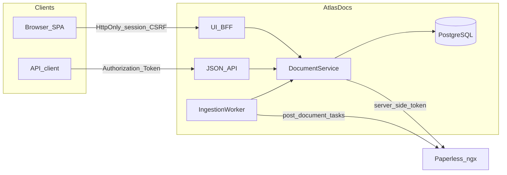
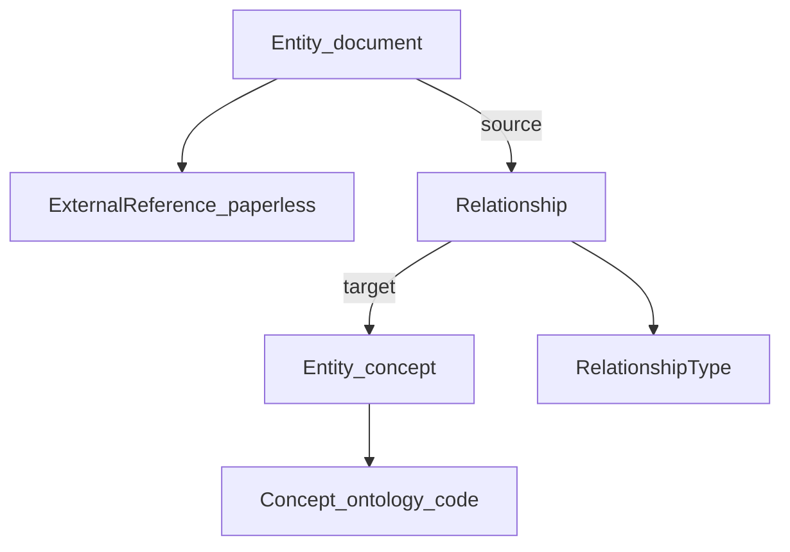

# AtlasDocs architecture

Canonical description of the current semantic layer (post-v0.4).

## Ownership boundary

| Concern | Owner |
| --- | --- |
| Document storage, OCR, search, previews, permissions, lifecycle | **Paperless-ngx** |
| Typed entities, concepts, relationships, provenance, classification workflows | **AtlasDocs** |

AtlasDocs never embeds a document viewer, never touches Paperless databases or
filesystems, and integrates only through the Paperless **REST API**.

See [paperless-integration.md](paperless-integration.md) for authorization and
URL rules.

## System boundaries

## Core model

### Entities

Every semantic object is an `Entity` with an AtlasDocs UUID.

| `entity_type` | Meaning |
| --- | --- |
| `document` | A document known to AtlasDocs (usually bound to Paperless) |
| `concept` | A coded concept in an ontology (country, document-type, person, organization, …) |

Person and organization are **concept entities** today, not separate
`EntityType` values.

### External references

Paperless document ids are never AtlasDocs primary keys. Binding is via:

`ExternalReference(system=paperless, external_id="<paperless_id>")`

Constraints:

- `UNIQUE(system, external_id)`
- One primary external binding per entity for the current schema

### Concepts and ontologies

Concepts belong to version-controlled ontologies loaded from seed YAML
(`config/seed/`). Concept rows share the same UUID as their entity
(`concepts.id` → `entities.id`).

### Relationships

Relationships are entity→entity edges:

- Typed by `RelationshipType` (optional target ontology, directionality, inverse)
- Provenance: `origin` (`manual`, `import`, `deterministic-rule`, `llm`, `mcp`, …)
- Status: typically `confirmed` for workbench writes
- Unique on `(source_entity_id, relationship_type_id, target_entity_id)`
- Symmetric / inverse companions are maintained when the type requires them

The document facade (`/documents/{paperless_id}`) remains for callers that
think in Paperless ids. General work uses `/entities/{uuid}`.

## Authorization

- JSON API: every document/entity request requires `Authorization` (Paperless token or Bearer). There is no password grant on the JSON API.
- UI: operators sign in with Paperless username/password; AtlasDocs exchanges credentials **server-side** for a token. Advanced token paste remains a development fallback.
- UI sessions and ingestion job tokens are stored in **PostgreSQL**, encrypted with `TOKEN_ENCRYPTION_KEY` (ADR 0002). The browser only receives an opaque HttpOnly cookie id and CSRF token.
- When Paperless denies access (401/403) or the document is missing (404), AtlasDocs returns **404** and does not leak titles or relationships. Bulk assign reports `forbidden_or_missing` per id only.

## Surfaces

| Surface | Role |
| --- | --- |
| JSON API | Programmatic clients (`/documents`, `/entities`, `/ingest`, `/reconcile`, …) |
| UI BFF + SPA | Home, classify, ingest, reconcile under `/ui` |
| CLI | `atlasdocs reconcile`, `atlasdocs worker ingest` |

Details: [api.md](api.md), [frontend.md](frontend.md), [reconciliation.md](reconciliation.md).

## Ingestion (v0.5)

Uploads are accepted by AtlasDocs, spooled temporarily, forwarded to Paperless
`post_document`, and tracked as durable `ingestion_jobs` until READY/FAILED.
Terminal jobs wipe `token_ciphertext`. Paperless remains document authority;
AtlasDocs never stores originals in Postgres.

## Known limitations (current)

- Correspondent / document-type labels resolve from Paperless payloads (including integer id lookups when needed).
- Document↔document edges in the UI target a Paperless id for types such as `derived-from` / `has-derivative`.
- Multi-worker autoscaling, webhooks, and automatic deletion are **not** implemented — see [roadmap.md](roadmap.md).

## History

Milestone proposals live under [archive/](archive/). Entity binding:
[adr/0001-entity-external-reference.md](adr/0001-entity-external-reference.md).
Session/ingest security: [adr/0002-v05-session-ingest-security.md](adr/0002-v05-session-ingest-security.md).
