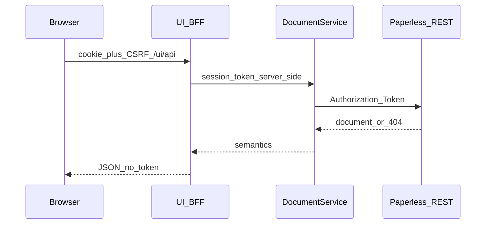

# AtlasDocs frontend

Canonical description of the SPA workbench (post-v0.5).

## Stack

The workbench is a **React + TypeScript + Vite** SPA served same-origin from
the AtlasDocs FastAPI container under `/ui`.

- Package root: `frontend/`
- Router: `react-router-dom`
- Icons: `lucide-react` (labeled controls)
- Build `base: '/ui/'` → assets under `src/atlasdocs/ui/spa` (copied in Docker)

Jinja server-rendered interaction was **retired** in v0.4. There is no
production Jinja fallback for `/ui`.

No Redux, Next.js, graph visualization libraries, LLMs, or MCP in the UI.

## Security

- Primary login: `POST /ui/api/login` with username/password (server-side token
  exchange). Advanced: `POST /ui/api/connect` token paste for local/dev.
- Tokens and passwords never appear in HTML, JavaScript, browser storage, or
  API JSON responses to the browser.
- Sessions are PostgreSQL-backed (opaque `atlasdocs_sid` cookie only).
- Mutating BFF calls require the session cookie and `X-CSRF-Token`. CSRF
  rotates after successful mutations.
- Unauthorized or inaccessible Paperless documents return 404 from the BFF
  with no semantic leakage.

## Paperless links

AtlasDocs does not embed a viewer. **Open in Paperless** uses
`PAPERLESS_PUBLIC_URL` only — never `PAPERLESS_BASE_URL` or Docker hostnames —
and never includes tokens. When `PAPERLESS_PUBLIC_URL` is unset, the action is
disabled.

See [paperless-integration.md](paperless-integration.md).

## Request flow



Programmatic clients use `/documents` and `/entities` with an `Authorization`
header. The SPA does not send the Paperless token to those paths.

## Routes

| Path | Screen |
| --- | --- |
| `/ui/` | Home launcher (global search, task queues, recent activity) |
| `/ui/explore` | Explore browse (modes, filters, list/grid) |
| `/ui/entities/:id` | Entity detail (concepts/people/orgs; documents redirect) |
| `/ui/classify` | Searchable classification workbench + bulk assign |
| `/ui/ingest` | Upload + ingestion job list |
| `/ui/documents/:id` | Document detail + composer (Preview / Download / Replace / Delete / Open in Paperless) |
| `/ui/reconcile` | Reconciliation (account menu; not primary nav) |
| `/ui/connect` | Login / account |

Primary product navigation: Home | Explore | Classify | Ingest. Reconcile and
Disconnect live under the account menu.

## BFF endpoints

| Method | Path | Purpose |
| --- | --- | --- |
| GET | `/ui/api/session` | `{authenticated, csrf_token, username_label}` |
| POST | `/ui/api/login` | Username/password → server-side token |
| POST | `/ui/api/connect` | Advanced token paste (dev fallback) |
| POST | `/ui/api/disconnect` | Invalidate UI session |
| GET | `/ui/api/home` | Authz-safe task counts + recent activity |
| GET | `/ui/api/documents` | List with `q`, `classification`, `sort`, `order`, `page` |
| POST | `/ui/api/documents/bulk-relationships` | Bulk assign (per-doc authz) |
| GET | `/ui/api/documents/{id}` | Document detail + relationships |
| DELETE | `/ui/api/documents/{id}` | Evidence trash (`confirm`) or permanent (`confirm` + `permanent`) |
| POST | `/ui/api/documents/{id}/restore` | Restore Evidence from Paperless trash |
| POST | `/ui/api/entities/{id}/rename` | Master Data rename |
| POST | `/ui/api/entities/{id}/archive` | Archive |
| POST | `/ui/api/entities/{id}/restore` | Restore archived entity |
| POST | `/ui/api/entities/{id}/merge` | Merge redirect placeholder |
| DELETE | `/ui/api/entities/{id}` | Master Data delete (`confirm`; blocked while linked) |
| POST | `/ui/api/documents/{id}/replace` | Failure-safe replace upload (async job) |
| POST | `/ui/api/documents/{id}/relationships` | Add relationship (prefer `target_entity_id`) |
| DELETE | `/ui/api/relationships/{id}` | Remove relationship |
| GET | `/ui/api/relationship-types` | Typed relationship catalog (source/target entity types) |
| GET | `/ui/api/entity-types` | Entity type registry |
| GET | `/ui/api/explore` | Entity-oriented Explore results |
| GET | `/ui/api/entities/search` | Atlas entity autocomplete (`q`, `entity_type`, `ontology`) |
| GET | `/ui/api/entities/{id}` | Entity detail with relationships, backlinks, related documents |
| GET | `/ui/api/concepts` | Concept autocomplete (`q`, `ontology`) |
| POST | `/ui/api/ingest` | Multipart upload → durable job |
| GET | `/ui/api/ingest/jobs` | Current identity’s jobs |
| GET | `/ui/api/ingest/jobs/{id}` | Job status |
| POST | `/ui/api/ingest/jobs/{id}/retry` | Retry `RETRYABLE_FAILURE` jobs |
| GET | `/ui/api/documents/{id}/preview` | Session-auth PDF/image preview stream |
| GET | `/ui/api/documents/{id}/download` | Session-auth download; supports `original=true` and `version={paperless_version_id}` |
| POST | `/ui/api/reconcile` | Dry-run / apply reconciliation |

SPA shell routes serve `index.html`. `/ui/api/*` is never shadowed by the SPA
fallback.

The relationship composer resolves **Atlas entity** targets via
`/ui/api/entities/search` (no raw Paperless ID field in the progressive UI).
Paperless identifiers stay in technical details; document detail offers
**Document actions:** Preview and Download via AtlasDocs BFF (session cookie;
no Paperless token in the browser). **Open original in Paperless** is a
secondary/advanced deep link via `PAPERLESS_PUBLIC_URL` when configured.

## Product character and brand

AtlasDocs should feel like a semantic engineering tool: calm technical
workspace, strong hierarchy, restrained surfaces, visible relationships.

Product identity (slogan, login/home/footer/About hierarchy, Paperless as
secondary infrastructure) is defined in [product-identity.md](product-identity.md).
Default slogan:

```text
Where evidence becomes knowledge.
```

Visual families:

- Deep navy — primary text, document identity
- Blue-to-cyan — relationships, active states
- White / light gray — workspace surfaces

Suggested CSS tokens (applied in the SPA):

```css
:root {
  --brand-start: #0d6cb6;
  --brand-middle: #3a4ccd;
  --brand-end: #08afc6;
  --brand-900: #102644;
  --background: #f7f9fc;
  --surface: #ffffff;
  --text-primary: #102644;
  --text-secondary: #4f647b;
  --success: #22c55e;
  --warning: #f59e0b;
  --danger: #dc2626;
}
```

Avoid generic sidebar-plus-card-grid dashboards, decorative gradients as page
backgrounds, and cream/terracotta “archival” skins from the retired Jinja UI.

## UI quality bar

- One dominant purpose per screen; classify-first hierarchy.
- Prefer whitespace and typography over cards and chrome.
- Keyboard and touch targets matter; do not use color as the only state cue.
- Distinguish confirmed relationships from suggestions (when suggestions exist).
- Before large UI changes, write a short design proposal (goal, hierarchy,
  product-specific idea) — see archived process notes under
  [archive/v0.2/ui-ux-design-spec.md](archive/v0.2/ui-ux-design-spec.md).

## Local development

```bash
# API (serves built SPA if present)
pip install -e '.[dev]'
uvicorn atlasdocs.main:app --reload --port 8080

# Frontend (Vite proxies /ui/api to :8080 during npm run dev)
cd frontend && npm install && npm run dev
```

Production images use a multi-stage Docker build: Node builds the SPA, then the
Python image copies `dist` and serves it.

More: [development.md](development.md), [testing.md](testing.md).

## History

Prior frontend architecture and brand drafts:
[archive/v0.4/](archive/v0.4/). Jinja proposal: [archive/v0.2/ui-design-proposal.md](archive/v0.2/ui-design-proposal.md).
