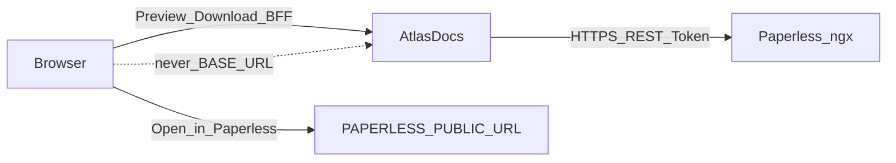

# Paperless integration

Canonical rules for how AtlasDocs talks to Paperless-ngx.

## Boundary

- Paperless owns document storage, OCR, search, previews, permissions, and
  lifecycle.
- AtlasDocs owns semantic entities and relationships only.
- Integration is **REST-only**. AtlasDocs never mounts Paperless media, never
  queries Paperless databases, and never embeds a document viewer.



## URL configuration

| Variable | Audience | Purpose |
| --- | --- | --- |
| `PAPERLESS_BASE_URL` | Server only | Origin for AtlasDocs → Paperless REST (may be an internal Docker hostname) |
| `PAPERLESS_PUBLIC_URL` | Browser links only | Origin for **Open in Paperless** deep links |

Rules:

- Browser links **never** fall back to `PAPERLESS_BASE_URL`.
- When `PAPERLESS_PUBLIC_URL` is unset, Open in Paperless is hidden/disabled
  (`open_url: null`).
- `PAPERLESS_PUBLIC_URL` must be `http`/`https` and must not include credentials
  (userinfo is rejected at settings validation).
- Links never include Paperless tokens.

## Authorization

- UI login exchanges Paperless username/password **server-side** for a token
  (`POST /api/token/`). Tokens never return to the browser.
- Every document-backed operation uses the **caller’s** Paperless token
  (API `Authorization` header or UI server-side session / encrypted job token).
- There is no shared service-token fallback for document access.
- Paperless `401`/`403` → AtlasDocs **404** (and no titles/relationships leaked).
- Paperless `404` → AtlasDocs **404**.
- Bulk relationship assignment re-checks Paperless access **per document**.
- Upstream timeouts / 5xx → treated as upstream errors (not silent success).

Native concept entities still require a Paperless-accepted token for API/BFF
calls so arbitrary strings cannot bypass auth.

## Adapter

`atlasdocs.services.paperless.PaperlessClient` is a thin HTTP adapter:

- `exchange_password` / `get_document` / `list_documents` / `post_document` /
  `get_task` / `find_document_id_by_title` / `stream_document_file` /
  `assert_accessible` / `validate_token`
- Resolves correspondent and document-type labels from nested objects or
  integer ids (cached secondary lookups)

## Ingestion

Uploads are accepted by AtlasDocs, forwarded via `POST /api/documents/post_document/`,
and tracked until Paperless consume completes and AtlasDocs can bind a
Paperless document id.

### Job FSM

| State | Meaning |
| --- | --- |
| `UPLOADING` | Spool on disk; forward to Paperless when claimed |
| `PROCESSING` | `post_document` task id recorded; poll Paperless task status |
| `RESOLVING_DOCUMENT` | Task succeeded but payload lacked a document id; correlate by title |
| `RETRYABLE_FAILURE` | Resolution timed out or worker error with spool still present; operator may retry |
| `READY` | Document id bound; semantic entity created; spool and job token wiped |
| `FAILED` | Terminal error (duplicate, auth, task failure, missing spool, processing timeout) |

Spool files and encrypted job tokens are retained through `UPLOADING`,
`PROCESSING`, and `RESOLVING_DOCUMENT`. They are deleted only on `READY` or
terminal `FAILED`. `RETRYABLE_FAILURE` keeps both so a retry can resume.

### Correlation title strategy

Each upload sets a deterministic Paperless document **title** at post time:

```text
atlasdocs:{job_uuid}
```

The original filename is preserved as the multipart `document` filename and in
AtlasDocs job metadata. When a Paperless task returns `SUCCESS` without a
document id in `related_document`, `result`, or `result_data`, AtlasDocs
enters `RESOLVING_DOCUMENT` and looks up exactly one document with
`title__iexact=atlasdocs:{job_uuid}`.

**Limitation:** AtlasDocs never matches by filename alone. If the task payload
never exposes a document id and title correlation fails (duplicate titles,
Paperless ignores the title field, etc.), the job moves to `RETRYABLE_FAILURE`.

Duplicate detection: AtlasDocs SHA-256 at enqueue; Paperless remains the
document duplicate authority on consume.

### Retry

`POST /ui/api/ingest/jobs/{id}/retry` (session auth + CSRF) resets a
`RETRYABLE_FAILURE` job:

- When `paperless_task_id` is set → `RESOLVING_DOCUMENT` (re-run title / task lookup)
- When no task id but spool exists → `UPLOADING` (re-post)

Terminal `FAILED` jobs cannot be retried.

Tune resolution with `INGEST_RESOLUTION_TIMEOUT_SECONDS`,
`INGEST_RESOLUTION_MAX_ATTEMPTS`, and `INGEST_RETRYABLE_RETENTION_SECONDS`
(see `.env.example`). Stale `RETRYABLE_FAILURE` jobs past the retention window
are reaped to terminal `FAILED` (token and spool wiped).

## Document content proxy

Preview and download are served by the UI BFF so the browser never sees a
Paperless token:

| Route | Behavior |
| --- | --- |
| `GET /ui/api/documents/{id}/preview` | Stream PDF/raster image inline (`Cache-Control: no-store`; SVG rejected) |
| `GET /ui/api/documents/{id}/download` | Stream bytes as attachment |

Both require an authenticated UI session. AtlasDocs checks Paperless access
server-side, streams upstream bytes through to the client, and does not write
document content to AtlasDocs disk. Inaccessible documents return **404** with
no title or body leak.

## Reconciliation

Creating missing document entities / Paperless external references, and
reporting orphans, is described in [reconciliation.md](reconciliation.md).
Reconciliation never auto-deletes semantic data.
