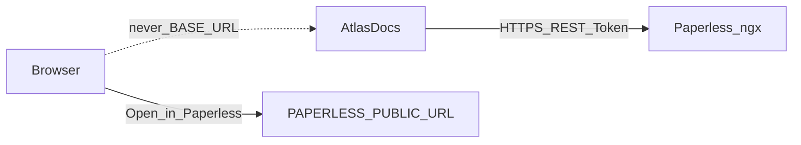

# Paperless integration

Canonical rules for how AtlasDocs talks to Paperless-ngx.

## Boundary

- Paperless owns document storage, OCR, search, previews, permissions, and
  lifecycle.
- AtlasDocs owns semantic entities and relationships only.
- Integration is **REST-only**. AtlasDocs never mounts Paperless media, never
  queries Paperless databases, and never embeds a document viewer.

## URL configuration

| Variable | Audience | Purpose |
| --- | --- | --- |
| `PAPERLESS_BASE_URL` | Server only | Origin for AtlasDocs → Paperless REST (may be an internal Docker hostname) |
| `PAPERLESS_PUBLIC_URL` | Browser links only | Origin for **Open in Paperless** deep links |

Rules:

- Browser links **never** fall back to `PAPERLESS_BASE_URL`.
- When `PAPERLESS_PUBLIC_URL` is unset, Open in Paperless is hidden/disabled
  (`open_url: null`).
- `PAPERLESS_PUBLIC_URL` must be `http`/`https` and must not include credentials
  (userinfo is rejected at settings validation).
- Links never include Paperless tokens.

## Authorization

- Every document-backed operation uses the **caller’s** Paperless token
  (API `Authorization` header or UI server-side session token).
- There is no shared service-token fallback for document access.
- Paperless `401`/`403` → AtlasDocs **404** (and no titles/relationships leaked).
- Paperless `404` → AtlasDocs **404**.
- Upstream timeouts / 5xx → treated as upstream errors (not silent success).

Native concept entities still require a Paperless-accepted token for API/BFF
calls so arbitrary strings cannot bypass auth.

## Adapter

`atlasdocs.services.paperless.PaperlessClient` is a thin HTTP adapter:

- `get_document` / `list_documents` / `assert_accessible` / `validate_token`
- Resolves correspondent and document-type labels from nested objects or
  integer ids (cached secondary lookups)

## Reconciliation

Creating missing document entities / Paperless external references, and
reporting orphans, is described in [reconciliation.md](reconciliation.md).
Reconciliation never auto-deletes semantic data.
