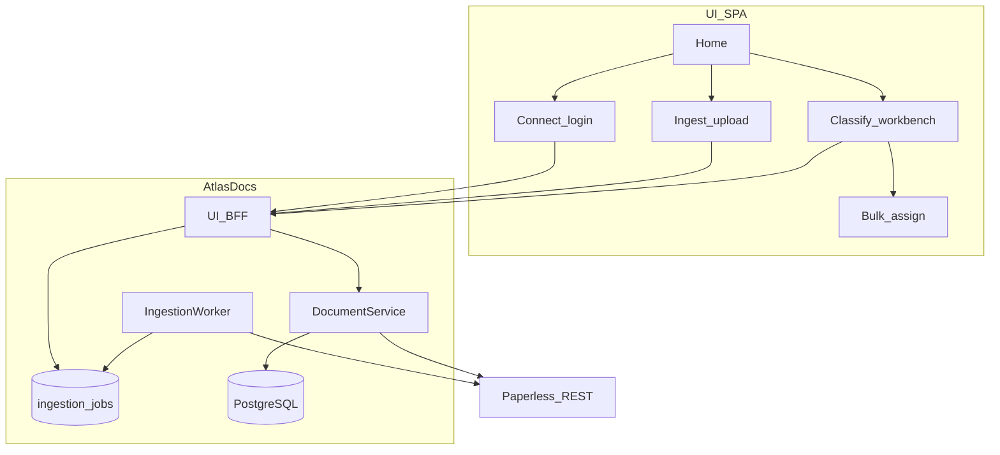
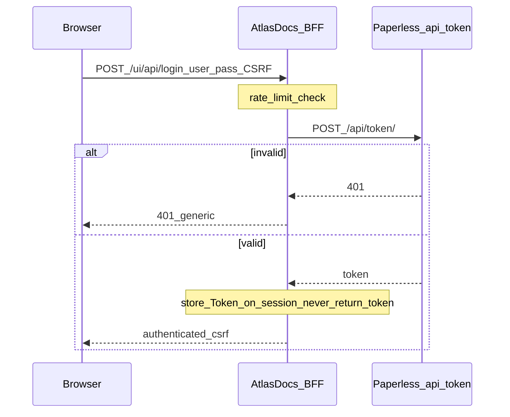
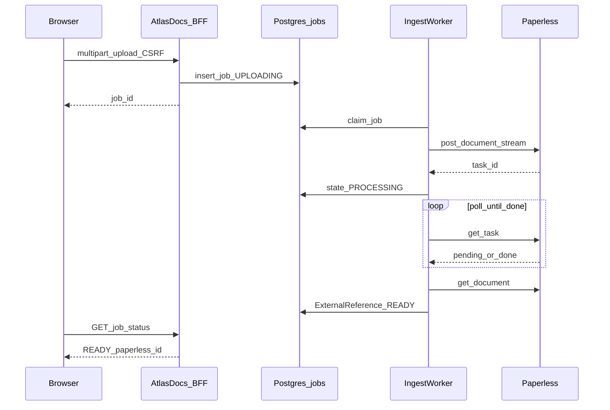
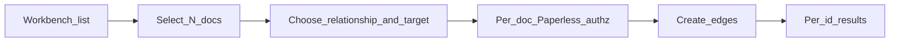

# AtlasDocs v0.5 — Ingestion & Classification Spec

**Status:** Proposed (not implemented)
**Baseline:** v0.4 semantic workbench on Entity + ExternalReference
**Scope:** Password login → server-side Paperless token, durable async upload
jobs, searchable classification workbench, bulk assignment, task-oriented home.

This document is a design contract for implementation. It does not change
runtime behavior until a follow-up implementation PR lands.

---

## 0. How to read this document

| Layer | Meaning |
| --- | --- |
| **v0.4 (implemented)** | Behavior that already ships; must not regress |
| **v0.5 (proposed)** | In scope for the next implementation milestone |
| **Deferred** | Explicitly out of v0.5 |

Canonical current docs: [architecture.md](architecture.md),
[frontend.md](frontend.md), [api.md](api.md),
[paperless-integration.md](paperless-integration.md),
[reconciliation.md](reconciliation.md), [testing.md](testing.md).

---

## 1. Goals and non-goals

### Goals

1. Let operators sign in with **Paperless username/password**; AtlasDocs
   exchanges credentials **server-side** for a Paperless API token and never
   exposes token or password to the browser.
2. Let operators **upload documents through AtlasDocs**; AtlasDocs streams the
   bytes to Paperless and tracks consumption with **durable async jobs**.
3. Make the classification workbench **searchable / filterable / sortable**,
   with **bulk relationship assignment** that re-checks authorization per
   document.
4. Introduce a **task-oriented home** that routes people to classify, ingest,
   reconcile, or search — without turning AtlasDocs into a Paperless clone.

### Non-goals (v0.5)

- SSO / OIDC
- LLMs, MCP, embeddings
- Graph visualization as primary UI
- Native notes / Evidence / Supernova
- Automatic deletion of semantic data
- A replacement Paperless viewer, OCR engine, or permission system
- Direct Paperless PostgreSQL or filesystem access

### Invariants (unchanged)

- Paperless owns original files, OCR, previews, downloads, permissions, and
  document lifecycle.
- AtlasDocs **must not** store original uploaded files after a successful
  forward to Paperless (transient buffers only).
- AtlasDocs talks to Paperless **only** via REST using `PAPERLESS_BASE_URL`.
- Browser “Open in Paperless” uses `PAPERLESS_PUBLIC_URL` only; never fall back
  to `PAPERLESS_BASE_URL` / Docker hostnames. Missing public URL → disable link.
- Paperless tokens and passwords never appear in HTML, JavaScript, URLs, browser
  storage, or application logs.
- Unauthorized / inaccessible Paperless documents never produce semantic
  results (404, no leak).

---

## 2. v0.4 baseline (implemented)

Summarized for contrast; details live in canonical docs.

| Area | v0.4 behavior |
| --- | --- |
| Auth (UI) | Operator pastes a Paperless API token into Connect; stored in **in-memory** HttpOnly session |
| Auth (API) | `Authorization: Token …` on every JSON request |
| CSRF | Required on BFF mutations; rotates after success |
| Workbench | Unclassified queue (Paperless page + AtlasDocs filter), detail, single relationship assign |
| Upload | **None** |
| Jobs / workers | **None** (reconcile is synchronous request/CLI) |
| Search | Concept autocomplete only; no document search/filter/sort beyond unclassified paging |
| Bulk classify | **None** |
| Navigation | Classify / Reconcile / Connect — no home hub |
| Public links | `open_url` from `PAPERLESS_PUBLIC_URL` |
| Schema | Entities, external_references, concepts, relationships (+ provenance) |

---

## 3. Proposed v0.5 overview



---

## 4. Authentication: username/password → server-side token

### 4.1 v0.4

`POST /ui/api/connect` accepts `{ paperless_token, csrf_token }`, normalizes to
`Token …`, stores it on the session.

### 4.2 v0.5 proposed

**Primary UI login:** username + password.

1. Browser submits username/password over HTTPS to AtlasDocs BFF only.
2. AtlasDocs server calls Paperless `POST {PAPERLESS_BASE_URL}/api/token/` with
   JSON `{ "username", "password" }` (server-to-server; no browser involvement).
3. On success, Paperless returns `{ "token": "…" }`. AtlasDocs stores
   `Authorization: Token <token>` on the **server-side session** and returns
   `{ authenticated: true, csrf_token }` — never the Paperless token.
4. On failure (401/403/400 from Paperless), AtlasDocs returns a generic
   authentication failure (**401**) without distinguishing “unknown user” vs
   “bad password” beyond what is safe; never echoes Paperless error bodies that
   might leak account existence details beyond a fixed message.

**Optional advanced path (development fallback):** paste API token remains
available behind an “Use API token” disclosure for local/dev operators.
**Production UX is username/password login.** Same storage rules for whichever
path authenticates. See [ADR 0002](adr/0002-v05-session-ingest-security.md).

**Programmatic JSON API:** unchanged — still requires `Authorization` header.
v0.5 does **not** add password grant to the public JSON API (avoids turning
AtlasDocs into a password proxy for scripts; scripts should use tokens).

### 4.3 Session, expiry, logout, CSRF

| Concern | v0.5 rule |
| --- | --- |
| Cookie | Opaque `atlasdocs_sid`, HttpOnly, `SameSite=Lax`, `Secure` per settings |
| Session store | **PostgreSQL-backed** durable sessions (not in-memory; no sticky-session requirement) |
| Expiry | Absolute TTL from `SESSION_MAX_AGE_SECONDS` (default 8h); sliding renewal **not** required in v0.5 |
| Logout | `POST /ui/api/disconnect` deletes the UI session row; new anonymous session + CSRF. In-flight ingestion jobs are **not** cancelled; they may finish using the job’s encrypted token snapshot. That ciphertext is **deleted when the job reaches READY or FAILED**. |
| CSRF | Double-submit / header `X-CSRF-Token` on all mutating BFF routes; rotate after successful mutations (including login) |
| Failed login | Generic 401; increment rate-limit counters |
| Rate limit | Per client IP **and** per username (when provided): e.g. 10 attempts / 10 minutes; then **429** with `Retry-After` |
| Lockout UX | Show “Too many attempts; try later” — do not reveal whether the username exists |

Passwords and tokens must never be written to logs (redact Authorization,
request bodies on `/login` and `/connect`).

Security decisions for sessions, job tokens, and encryption:
[ADR 0002](adr/0002-v05-session-ingest-security.md).
### 4.4 Auth sequence



---

## 5. Upload and durable ingestion jobs

### 5.1 Ownership

| Step | Owner |
| --- | --- |
| Accept multipart upload from browser | AtlasDocs BFF |
| Stream bytes to Paperless consume API | AtlasDocs worker / upload handler |
| Persist original file, OCR, preview, ACLs | **Paperless only** |
| Track job state for the operator | AtlasDocs `ingestion_jobs` |

AtlasDocs **must not** retain original file bytes after Paperless accepts the
upload (or after a terminal failure cleanup). Temp files, if any, live under an
OS temp dir and are deleted in `finally`.

### 5.2 Paperless API (server-side)

Using `PAPERLESS_BASE_URL` + session token:

1. **Forward upload:** `POST /api/documents/post_document/` (multipart), fields
   aligned with Paperless (`document` file required; optional title, etc. as
   allowed by Paperless). Prefer streaming multipart to avoid buffering large
   files in RAM when practical.
2. **Observe processing:** Paperless returns a **task id** (UUID string) for
   async consume. AtlasDocs polls `GET /api/tasks/?task_id=<id>` (or the
   documented task detail endpoint for the pinned Paperless version) until
   success/failure/timeout.
3. On success, extract **Paperless document id**; create/get AtlasDocs
   `Entity(document)` + `ExternalReference(system=paperless)`.

Exact Paperless task payload field names are locked by **mocked contract tests**
against the pinned Paperless API shapes before Phase D implementation (see
§18 resolved decisions). The state machine below remains normative for
AtlasDocs.

### 5.3 Job states

```text
UPLOADING → PROCESSING → READY
                ↘ FAILED
```

| State | Meaning |
| --- | --- |
| `UPLOADING` | AtlasDocs accepted the browser upload; forward to Paperless not yet confirmed |
| `PROCESSING` | Paperless accepted the file; consume/OCR in progress (or poll in progress) |
| `READY` | Paperless document id known; AtlasDocs external reference ensured; safe to classify |
| `FAILED` | Terminal failure (auth, upstream, timeout, rejected file, duplicate policy) |

Transitions are recorded with timestamps and a short **safe** error code/message
(no Paperless stack traces, no filenames that include secrets).

### 5.4 Durability and worker

Jobs are rows in PostgreSQL so they **survive process restarts**.

v0.5 introduces a single **ingestion worker** process (Compose service or
`atlasdocs worker ingest`) that:

1. Claims jobs in `UPLOADING` / `PROCESSING` with `FOR UPDATE SKIP LOCKED`
   (or equivalent lease columns: `locked_at`, `locked_by`).
2. Performs upload / poll / finalize.
3. Releases the lease on completion or crash (stale lease reclaim after N
   seconds).

No Redis/Celery requirement in v0.5. No multi-tenant queue fairness beyond
FIFO per user session token hash.

**Auth for the worker:** each job stores an encrypted snapshot of the Paperless
`Authorization` value at enqueue time.

- **Required:** encrypt with a dedicated `TOKEN_ENCRYPTION_KEY` (not optional;
  production must set a non-default key — see ADR 0002).
- Decrypt only in worker memory; wipe plaintext from memory after each use.
- **Logout** invalidates the UI session only. Already-accepted jobs may continue
  with their encrypted job token until `READY` or `FAILED`.
- When a job reaches a **terminal** state (`READY` or `FAILED`), **delete**
  `token_ciphertext` from the row (set NULL). Fingerprint and metadata may
  remain for history/ownership checks.

### 5.5 Retry, duplicate, timeout, failures

| Case | Behavior |
| --- | --- |
| Transient Paperless 5xx / timeout during upload | Remain/retry within `UPLOADING` up to `INGEST_MAX_ATTEMPTS` (default 3) with exponential backoff; then `FAILED` |
| Transient failure while polling tasks | Stay `PROCESSING`; retry poll; hard timeout `INGEST_PROCESSING_TIMEOUT_SECONDS` (default 30 minutes) → `FAILED` |
| Paperless 401/403 mid-job | `FAILED` with code `paperless_unauthorized` |
| Operator **Retry** on `FAILED` | Creates a **new** job only if the original bytes are gone — therefore v0.5 Retry means **re-upload** from the browser, not silent replay (unless temp retention window — **not** proposed). UI: “Upload again”. |
| Duplicate content | **Both layers:** (1) AtlasDocs computes SHA-256 while streaming; if the same `token_fingerprint` already has a `READY` job or known document binding with that checksum and the Paperless doc is still accessible → **409** on enqueue with existing `paperless_document_id` when known. (2) Paperless remains the document duplicate authority — if Paperless rejects a duplicate on consume, map to `FAILED` / `duplicate` with a safe message. |
| Client disconnect mid-upload | Abort; no job row, or mark `FAILED` if row was created pre-stream — prefer create job row only after temp spool starts, transition to `UPLOADING`, delete spool on failure |

### 5.6 Upload / processing flow



---

## 6. Searchable classification workbench

### 6.1 v0.4

`GET /ui/api/documents?unclassified=true&page=` — one Paperless page, filter to
documents without confirmed relationships.

### 6.2 v0.5 proposed

Workbench list supports:

| Capability | Behavior |
| --- | --- |
| Document metadata search / sort / Paperless filters | Served via **Paperless** list/query APIs (`q`, title/created sorts, and other metadata filters supported by the pinned version) |
| Semantic filters | Served via **AtlasDocs** queries (e.g. `classification=unclassified\|classified\|any` from relationship presence; ingestion job linkage) — intersect with Paperless-visible ids under the caller’s token |
| Pagination | Keep page size cap (25) |

**Split of responsibility:** Paperless owns document metadata filtering;
AtlasDocs owns semantic filtering. Do not build an AtlasDocs full-text index of
document bodies in v0.5.

**Authorization:** every listed id must be accessible with the caller’s token;
never merge in AtlasDocs-only rows for Paperless ids the token cannot read.

Detail pane unchanged in spirit: metadata, relationships, Open in Paperless,
composer. Add ingestion badge when a recent job exists.

---

## 7. Bulk relationship assignment

### 7.1 Behavior

Operator selects N documents in the workbench (max **50** per request) and
applies one relationship (same body shape as single create: type + exactly one
target).

Server **must**:

1. Require CSRF + session (BFF) or Authorization (JSON API).
2. For **each** `paperless_document_id`, call `_ensure_paperless_access` (or
   equivalent) **individually**.
3. Skip / record failure for inaccessible ids **without** leaking titles.
4. Create relationships for accessible docs; treat per-doc duplicates as
   `skipped_duplicate` (not hard-fail the whole batch unless `strict=true`).
5. Return a per-id result list: `created | skipped_duplicate | forbidden_or_missing | validation_error`.

No partial semantic disclosure: forbidden ids appear only as ids + status
`forbidden_or_missing`.

### 7.2 Classification + bulk flow



---

## 8. Home screen and navigation

### 8.1 v0.4

Routes: `/ui/connect`, `/ui/` (queue), `/ui/documents/:id`, `/ui/reconcile`.

### 8.2 v0.5 proposed

Authenticated **Home** at `/ui/` (queue moves to `/ui/classify`):

| Card / action | Destination | Purpose |
| --- | --- | --- |
| Classify | `/ui/classify` | Searchable workbench |
| Ingest | `/ui/ingest` | Upload + job list |
| Reconcile | `/ui/reconcile` | Existing reconcile UI |
| Connect / account | `/ui/connect` | Login, logout, token advanced |

Unauthenticated users hitting `/ui/*` (except static) redirect to Connect.

Keep brand hierarchy: AtlasDocs mark + one primary task per screen. Home is a
**chooser**, not a metrics dashboard (no stat strips).

---

## 9. Authorization and information-leak prevention

| Rule | Detail |
| --- | --- |
| Denial → 404 | Document detail, relationships, open_url payload |
| Bulk | Per-id `forbidden_or_missing` only |
| Jobs | Visible to callers matching `token_fingerprint`; after logout, re-login with the same Paperless identity can see jobs. Never list other fingerprints’ jobs. `token_ciphertext` is absent once READY/FAILED. |
| Logs | No passwords, tokens, or raw upload paths |
| Errors | Stable error codes; no upstream body passthrough |
| Public URL | Unset → `open_url: null` / disabled control |

---

## 10. Public Paperless document links

Unchanged rules; apply also to ingestion READY state:

- Build `{PAPERLESS_PUBLIC_URL}/documents/{id}/` only when public URL configured
  and valid (http/https, no userinfo).
- Never use `PAPERLESS_BASE_URL` for browser navigation.
- Never attach tokens to the URL.

---

## 11. API contracts

### 11.1 BFF additions (session + CSRF)

| Method | Path | Purpose |
| --- | --- | --- |
| POST | `/ui/api/login` | `{username, password, csrf_token}` → session auth |
| `POST` | `/ui/api/connect` | Advanced **development** token paste fallback |
| POST | `/ui/api/disconnect` | Logout |
| GET | `/ui/api/session` | `{authenticated, csrf_token}` |
| POST | `/ui/api/ingest` | multipart upload → `{job_id}` |
| GET | `/ui/api/ingest/jobs` | list current user’s jobs |
| GET | `/ui/api/ingest/jobs/{job_id}` | job status |
| GET | `/ui/api/documents` | extended query: `q`, `classification`, `sort`, `order`, `page` |
| POST | `/ui/api/documents/bulk-relationships` | bulk assign |

### 11.2 JSON API additions (Authorization header)

| Method | Path | Purpose |
| --- | --- | --- |
| POST | `/ingest` | multipart upload (token auth) → job |
| GET | `/ingest/jobs/{job_id}` | job status (must prove same token fingerprint) |
| POST | `/documents/bulk-relationships` | bulk assign |
| GET | `/documents` | same filter/sort extensions |

No password login on JSON API.

### 11.3 Representative payloads

Login:

```json
POST /ui/api/login
{ "username": "ada", "password": "…", "csrf_token": "…" }
→ 200 { "authenticated": true, "csrf_token": "…" }
→ 401 { "detail": "Authentication failed" }
→ 429 { "detail": "Too many attempts" }
```

Job:

```json
{
  "id": "uuid",
  "state": "PROCESSING",
  "created_at": "…",
  "updated_at": "…",
  "paperless_document_id": null,
  "paperless_task_id": "…",
  "error_code": null,
  "error_message": null,
  "original_filename": "payslip.pdf",
  "content_sha256": "…"
}
```

Bulk:

```json
POST /ui/api/documents/bulk-relationships
{
  "csrf_token": "…",
  "paperless_document_ids": [184, 185, 999],
  "relationship": "source-country",
  "target": "germany",
  "strict": false
}
→ {
  "results": [
    { "paperless_document_id": 184, "status": "created", "relationship_id": "…" },
    { "paperless_document_id": 185, "status": "skipped_duplicate" },
    { "paperless_document_id": 999, "status": "forbidden_or_missing" }
  ]
}
```

---

## 12. Database changes

New Alembic revision(s) (expand-only; no break of v0.4 semantic tables).

### `ui_sessions` (durable UI sessions)

Replace the v0.4 in-memory session store.

| Column | Type | Notes |
| --- | --- | --- |
| `id` | VARCHAR/UUID PK | Opaque session id (cookie value) |
| `csrf_token` | VARCHAR NOT NULL | |
| `expires_at` | TIMESTAMPTZ NOT NULL | |
| `paperless_authorization_ciphertext` | BYTEA/TEXT NULL | encrypted Token … when authenticated |
| `token_fingerprint` | CHAR(64) NULL | for correlating jobs / ownership |
| `created_at` / `updated_at` | TIMESTAMPTZ | |
| `username_label` | VARCHAR NULL | display only; never password |

### `ingestion_jobs`

| Column | Type | Notes |
| --- | --- | --- |
| `id` | UUID PK | |
| `state` | ENUM/VARCHAR | `UPLOADING` \| `PROCESSING` \| `READY` \| `FAILED` |
| `created_at` / `updated_at` | TIMESTAMPTZ | |
| `created_by_label` | VARCHAR NULL | optional display label (username), never password |
| `session_id` | VARCHAR NULL | creating session (informational; may be deleted on logout) |
| `token_ciphertext` | BYTEA/TEXT NULL | encrypted Paperless Authorization; **NULL after READY/FAILED** |
| `token_fingerprint` | CHAR(64) | SHA-256 of token for ownership checks (not reversible) |
| `original_filename` | VARCHAR | basename only |
| `content_sha256` | CHAR(64) | AtlasDocs checksum for duplicate detection |
| `content_size_bytes` | BIGINT | |
| `paperless_task_id` | VARCHAR NULL | |
| `paperless_document_id` | INT NULL | |
| `attempt_count` | INT | |
| `next_attempt_at` | TIMESTAMPTZ NULL | |
| `locked_at` / `locked_by` | | worker lease |
| `error_code` / `error_message` | VARCHAR NULL | safe, truncated |
| `entity_id` | UUID NULL FK → entities | set when READY |

Indexes: `(state, next_attempt_at)`, `(token_fingerprint, content_sha256)`,
`(token_fingerprint, created_at DESC)`, `(expires_at)` on sessions.

No original file BYTEA column.

---

## 13. Configuration additions

| Variable | Purpose | Default |
| --- | --- | --- |
| `INGEST_MAX_ATTEMPTS` | Upload/poll retries | `3` |
| `INGEST_PROCESSING_TIMEOUT_SECONDS` | Max time in PROCESSING | `1800` |
| `INGEST_MAX_UPLOAD_BYTES` | Reject larger uploads | `52428800` (50 MiB), configurable |
| `INGEST_BULK_MAX_DOCUMENTS` | Bulk assign cap | `50` |
| `LOGIN_RATE_LIMIT_ATTEMPTS` | | `10` |
| `LOGIN_RATE_LIMIT_WINDOW_SECONDS` | | `600` |
| `TOKEN_ENCRYPTION_KEY` | **Required** key for session + job token ciphertext | no silent default in production |

Existing: `PAPERLESS_BASE_URL`, `PAPERLESS_PUBLIC_URL`, session settings.
`SESSION_SECRET` remains for cookie signing / general secrets; it must **not**
substitute for `TOKEN_ENCRYPTION_KEY` in production.

---

## 14. UI surfaces (v0.5)

| Route | Role |
| --- | --- |
| `/ui/connect` | Username/password (production); advanced token paste (dev fallback) |
| `/ui/` | Home chooser |
| `/ui/classify` | Searchable workbench + bulk |
| `/ui/documents/:id` | Detail + composer |
| `/ui/ingest` | Upload dropzone + job table |
| `/ui/reconcile` | Existing |

---

## 15. Testing and acceptance criteria

### 15.1 Unit

- Token encryption round-trip; fingerprint stability
- Job state transition guards (illegal transitions rejected)
- Login rate limiter windows
- Bulk result aggregation helpers

### 15.2 API / BFF

- Login success stores token server-side; response body has no token/password
- Login failure → 401 generic; rate limit → 429
- Upload enqueues job; worker fake Paperless → READY + ExternalReference
- Poll timeout → FAILED
- Duplicate checksum → 409 with existing id when known
- Documents list honors authz (denied ids absent)
- Bulk: mixed created / forbidden_or_missing; forbidden id has no title fields
- `open_url` null without `PAPERLESS_PUBLIC_URL`; never contains base Docker host

### 15.3 Integration

- Fake Paperless transport extended: `/api/token/`, `post_document`, tasks —
  **contract tests** pin request/response shapes before worker implementation
- Worker crash mid-PROCESSING: lease expiry allows reclaim and completion
- Restart API process: **sessions and jobs** still queryable from PostgreSQL
- Terminal job clears `token_ciphertext`

### 15.4 Browser (Playwright)

- Login with username/password; storage dump has no password/token
- Upload sample file; job reaches READY (mocked Paperless)
- Classify search filter; bulk assign two docs
- Home navigation to ingest/classify/reconcile
- Open in Paperless disabled when public URL unset

### 15.5 Acceptance checklist

1. Password never appears in network responses to the browser after submit.
2. Paperless token never appears in browser storage, HTML, or JSON to the SPA.
3. Original file bytes are not in Postgres and not left on disk after READY/FAILED cleanup.
4. Job and UI session survive API container restart (PostgreSQL-backed).
5. Inaccessible Paperless ids never return relationship payloads.
6. Bulk assignment rechecks every document.
7. Missing `PAPERLESS_PUBLIC_URL` disables links; no silent fallback to `PAPERLESS_BASE_URL`.
8. `TOKEN_ENCRYPTION_KEY` required in production; job token ciphertext removed on READY/FAILED.
9. AtlasDocs SHA-256 duplicate check and Paperless duplicate rejection both covered by tests.

---

## 16. Explicitly deferred (beyond v0.5)

- SSO/OIDC, passkeys
- Multi-worker autoscaling, Celery/RQ, webhooks from Paperless
- LLM classification, MCP, embeddings, graph UI
- Native notes, Evidence, Supernova
- Automatic semantic deletion when Paperless deletes files
- Silent retry-from-bytes without re-upload
- JSON API password grant
- AtlasDocs-side full-text index independent of Paperless
- Sliding session renewal / “remember me”
---

## 17. Proposed implementation phases (no code yet)

| Phase | Deliverable |
| --- | --- |
| **A** | Spec decisions recorded (this revision); mocked Paperless **contract tests** for `token` / `post_document` / `tasks` |
| **B** | Alembic `ui_sessions` + `ingestion_jobs`; `TOKEN_ENCRYPTION_KEY` helpers; FakePaperless extensions |
| **C** | Login BFF + rate limit + Connect UX (password primary; token paste = dev fallback) |
| **D** | Ingest API + worker + Ingest UI; terminal ciphertext wipe |
| **E** | Workbench: Paperless metadata queries + AtlasDocs semantic filters; Home routes |
| **F** | Bulk relationships API + UI |
| **G** | Playwright + CI worker smoke; promote stable behavior into canonical docs |

---

## 18. Design decisions (resolved)

Previously open questions — **resolved for v0.5** (do not reopen in
implementation PRs without a new ADR):

| # | Decision |
| --- | --- |
| 1 | **Verify** the pinned Paperless API and task payload with **mocked contract tests** before coding the worker. |
| 2 | **`TOKEN_ENCRYPTION_KEY` is required** for encrypting tokens used by background jobs (and durable session auth material). |
| 3 | Store **durable UI sessions and jobs in PostgreSQL**; do **not** rely on sticky sessions or in-memory session stores. |
| 4 | Calculate **AtlasDocs SHA-256** checksums for duplicate detection at enqueue. |
| 5 | Keep **Paperless as the document duplicate authority** as well (honor Paperless duplicate rejection). |
| 6 | Use **Paperless queries** for document metadata filters; use **AtlasDocs queries** for semantic filters. |
| 7 | Configurable upload limit; **initial default 50 MiB** (`INGEST_MAX_UPLOAD_BYTES=52428800`). |
| 8 | **Token paste** remains an **advanced development fallback**; **production UX is username/password login**. |
| 9 | **Logout** invalidates the UI session; already-accepted ingestion jobs may finish using their encrypted job token; **delete ciphertext when the job completes or fails**. |

Normative security write-up: [ADR 0002](adr/0002-v05-session-ingest-security.md).

### Remaining implementation notes (not product ambiguities)

- Exact JSON field paths in Paperless task success payloads — captured by
  contract tests in Phase A (not a product decision).
- Encryption algorithm details (e.g. AES-GCM) — implementation choice under
  ADR 0002 constraints.
---

## 19. Risks

| Risk | Mitigation |
| --- | --- |
| Large uploads exhaust memory | Stream/spool to temp; size cap; never BYTEA |
| Worker becomes a mini-queue product | Single worker, SKIP LOCKED, no Celery in v0.5 |
| Token ciphertext breach | Required `TOKEN_ENCRYPTION_KEY`; wipe ciphertext on terminal state; fingerprint for authz |
| Paperless API drift | Contract tests + pinned version |
| Authz bugs in bulk/search | Per-id ensure access; property tests with denied set |
| Multi-replica session loss | PostgreSQL sessions (no sticky dependency) |
| Scope creep into viewer/SSO/LLM | Non-goals list; reject in review |

---

## 20. Documentation follow-ups (after implementation)

When v0.5 ships, fold stable behavior into canonical
`architecture.md` / `frontend.md` / `api.md` / `paperless-integration.md` /
`development.md` / `testing.md` / `roadmap.md`, and move this file to
`docs/archive/v0.5/` with a historical banner.
