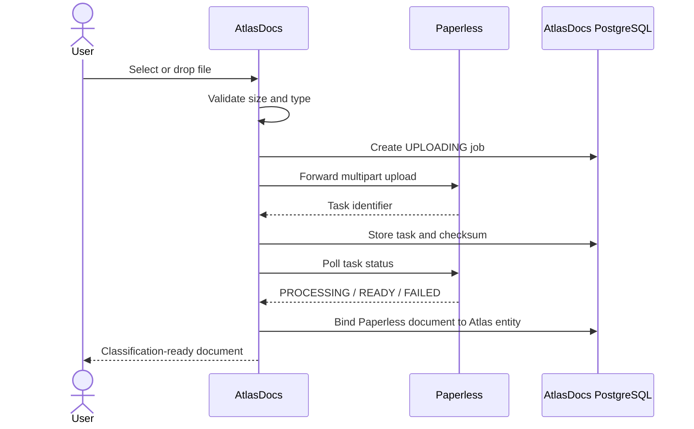

# AtlasDocs v0.5 Product and UX Refinement

## Scope

This is an implementation brief for the public AtlasDocs repository only.

It does not describe deployment, production paths, domains, Docker orchestration, secrets, or private infrastructure.

Read together with:

- `docs/v0.5-ingestion-classification-spec.md`
- `docs/adr/0002-v05-session-ingest-security.md`
- `docs/frontend.md`
- `docs/architecture.md`

This document resolves the product and frontend corrections that must be included in the v0.5 implementation PR.

## Product direction

AtlasDocs is the user-facing semantic work surface.

Paperless is the document authority and backend service, but it should not dominate the AtlasDocs interface. Users work with Atlas entities, relationships, knowledge, and tasks. Paperless remains responsible for original files, OCR, previews, downloads, permissions, and document lifecycle.

The UI should feel like a focused knowledge-engineering tool rather than a secondary Paperless administration screen.

## Required v0.5 capabilities

### 1. Authentication

Provide a normal connection flow:

```text
Username + password
        -> Paperless token exchange
        -> token stored server-side
        -> opaque AtlasDocs session cookie
```

Rules:

- The password is discarded immediately after token exchange.
- Paperless tokens never reach browser JavaScript, HTML, URLs, logs, or browser storage.
- Durable sessions use PostgreSQL.
- Durable ingestion jobs use encrypted tokens protected by `TOKEN_ENCRYPTION_KEY`.
- Job tokens are wiped on `READY` or `FAILED`.
- Logout invalidates the UI session but does not corrupt an already accepted ingestion job.
- CSRF protection remains mandatory for mutations.
- Rate-limit failed login attempts.
- Token paste may remain as an explicitly advanced development fallback, not the primary production UX.

### 2. Upload

AtlasDocs owns the upload experience but not the document file.



States:

```text
UPLOADING -> PROCESSING -> READY
                     \-> FAILED
```

Requirements:

- Default maximum upload size: 50 MB, configurable.
- Stream uploads where practical; do not retain the original file in AtlasDocs.
- Persist job ID, checksum, filename, task ID, Paperless document ID, state, error, attempts, and timestamps.
- Jobs survive application restarts.
- Retry behavior must be explicit and bounded.
- Duplicate detection must use an AtlasDocs checksum and Paperless response/identity where available.
- A failed upload must not create a misleading semantic entity.
- A successful Paperless task must create or bind the AtlasDocs document entity idempotently.

### 3. Home screen

The default screen must be an AtlasDocs application home, not only a raw unclassified list.

It should provide task-oriented summaries:

- Needs classification.
- Needs review.
- Failed ingestion.
- Reconciliation issues.
- Recently added documents.
- Recently changed knowledge.

Counts must respect Paperless authorization and must not reveal inaccessible-document totals.

The classification workbench remains a dedicated mode accessible from the home screen.

### 4. Classification workbench

The workbench must support:

- Free-text search.
- Date range.
- Correspondent.
- Document type.
- Paperless tags where available.
- Classification state.
- Semantic completeness.
- Source/import batch where available.
- Sorting by newest, oldest, date added, title, and correspondent.
- Stable pagination.

Do not reproduce all Paperless filtering. Use Paperless for document-level queries and AtlasDocs for semantic filters.

### 5. Bulk classification

Users must be able to select multiple documents and apply common typed relationships.

Example:

```text
Search: Airbus payslip
Select: 25 documents
Apply:
  document-type -> Payslip
  source-country -> Germany
  concerns -> Didac
```

Requirements:

- Authorization is rechecked server-side for every document.
- Operations are idempotent.
- Return per-document success and failure results.
- Do not apply relationships to inaccessible or deleted documents.
- Never rely only on the document list previously shown in the browser.

## AtlasDocs vocabulary and relationship UX

### 1. Hide implementation identity

Do not expose Paperless IDs as normal UI values.

The user selects AtlasDocs entities. Internally:

```text
Atlas entity UUID
        -> ExternalReference
        -> Paperless document ID
```

Paperless IDs may appear only in a collapsed technical-details section.

### 2. Entity autocomplete

Replace a raw target-ID field with:

```text
Target type
[ Document                 v ]

Target
[ Search AtlasDocs...       ]

Suggestions
  2026-06 Airbus payslip
  France tax declaration 2025
  Insurance summary
```

The search endpoint must return:

- Atlas entity UUID.
- Human-readable label.
- Entity type.
- Safe display metadata.
- Optional Paperless public link when applicable.

It must not return inaccessible Paperless-backed entities or expose credentials/internal identifiers unnecessarily.

Autocomplete must support keyboard navigation, loading, empty, error, and no-results states.

### 3. Progressive relationship creation

Do not present relationship type and target as unrelated horizontal controls.

Use this sequence:

```text
Add relationship
    -> choose target entity type
    -> choose relationship type
    -> search AtlasDocs entities
    -> confirm target
    -> save
```

The form should be vertically stacked and usable on mobile.

### 4. Consistent controls

Inputs, selects, autocomplete fields, textareas, and buttons must share:

- consistent height;
- consistent typography;
- consistent border and focus treatment;
- consistent radius;
- consistent disabled/loading/error states.

Use the existing AtlasDocs design tokens. Do not mix browser-default controls with custom controls or introduce a second visual language.

### 5. Document header

The document detail view should establish context immediately:

```text
2026-07 Airbus payslip
Germany · Payslip · Airbus · 2026

[ Classify ] [ Add relationship ] [ Open original ]
```

The header should prioritize title, date, type, correspondent, semantic state, and primary actions.

### 6. Original document action

Use an action-styled button, not a weak inline link:

```text
[ Open original in Paperless ]
```

Rules:

- Paperless remains responsible for viewing, preview, download, and authorization.
- Do not embed or recreate the Paperless viewer.
- Use `PAPERLESS_PUBLIC_URL` for the browser-facing destination.
- Never use the internal server URL for browser navigation.
- Never place tokens or credentials in the URL.
- If the public URL is absent, disable the action safely.
- Open in a new tab with appropriate `noopener` behavior.

### 7. Technical details

Technical information must not dominate the page.

Put the following in a collapsed section such as `Technical details` or `Advanced`:

- Paperless document ID.
- External reference.
- Source filename.
- Checksum.
- Task ID.
- Raw integration state.

The default view should communicate AtlasDocs concepts, not implementation details.

## Visual direction

Follow the existing AtlasDocs brand direction:

- neutral workspace surfaces;
- deep navy primary text;
- blue/cyan gradient as a controlled brand accent;
- whitespace and strong hierarchy;
- relationship nodes and connected structures as a meaningful motif;
- restrained borders and shadows;
- no generic dashboard card grid;
- no decorative charts or gradients without product meaning.

The frontend remains React + TypeScript + Vite. Do not introduce Redux, Next.js, a graph editor, or a second frontend framework for v0.5.

## Deferred work

Do not implement these in v0.5:

- Custom document preview.
- Global command palette.
- Full global search across every entity.
- Graph visualization.
- Native Markdown notes.
- LLM suggestions or summaries.
- MCP.
- Embeddings.
- Supernova burst compute.
- SSO/OIDC.
- Automatic deletion or destructive reconciliation.

The UI should leave room for these features without pretending they already exist.

## Acceptance criteria

1. Users can connect with Paperless credentials without pasting a token in the normal flow.
2. Passwords and tokens never reach the browser or logs.
3. Users can upload a document through AtlasDocs.
4. Upload jobs survive restart and expose clear state transitions.
5. Successful Paperless ingestion creates or binds one AtlasDocs entity.
6. Duplicate uploads are detected deterministically.
7. The home screen provides task-oriented work areas.
8. Classification supports search, filters, sorting, and pagination.
9. Bulk relationship assignment works with per-document authorization checks.
10. Relationship targets are selected as AtlasDocs entities, not raw Paperless IDs.
11. The document detail view has a clear header and consistent primary actions.
12. Technical Paperless details are secondary and collapsible.
13. `Open original in Paperless` uses the configured public URL safely.
14. Existing v0.4 API compatibility remains intact.
15. Backend, frontend, security, failure, responsive, and browser tests pass.
16. The container builds without requiring production services.
